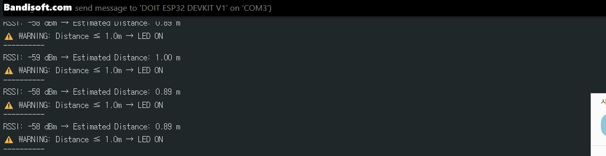
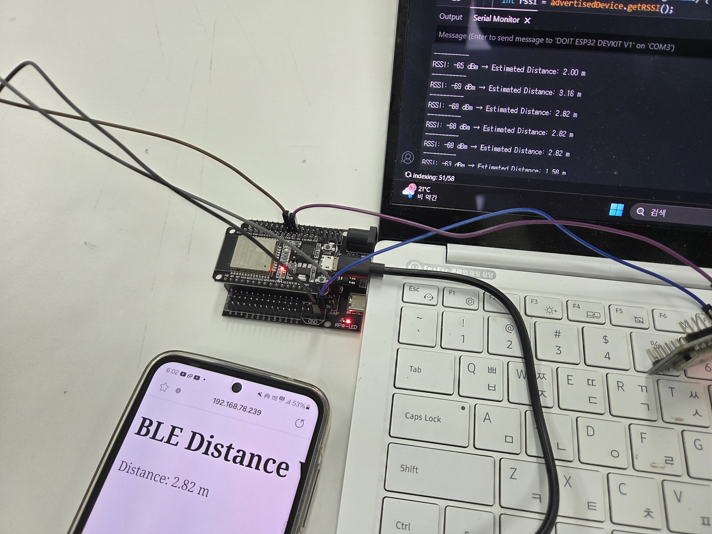
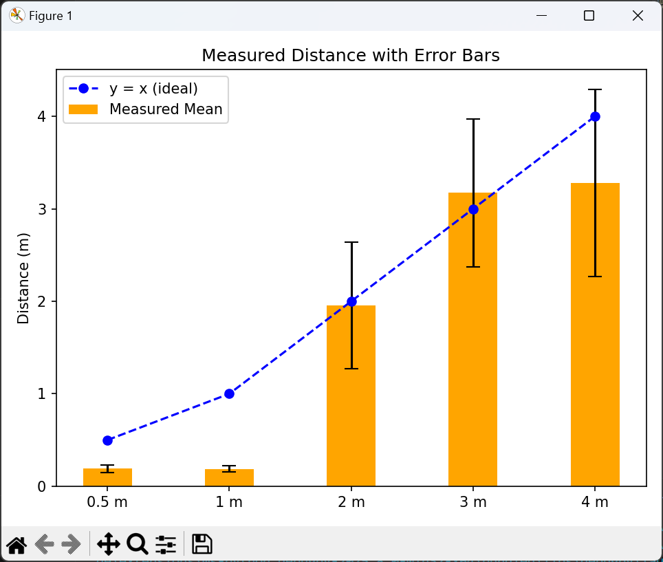
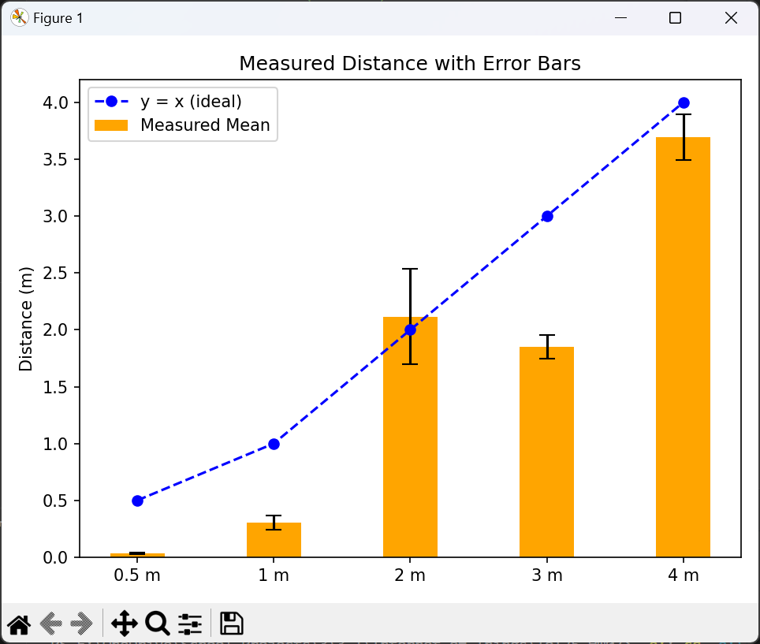
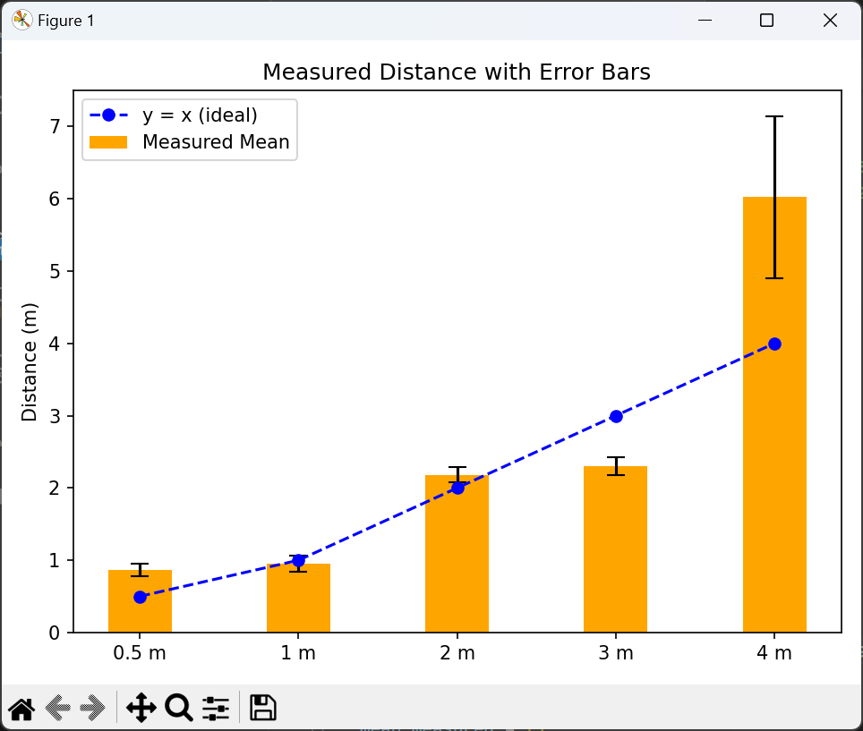
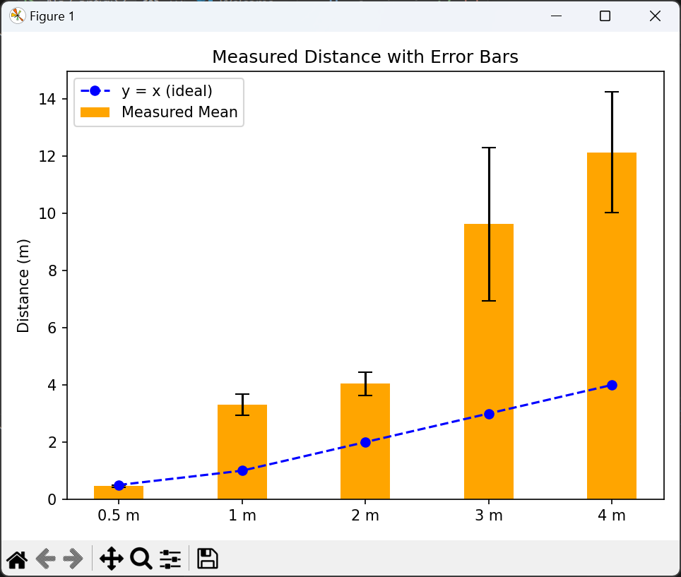

# IoT25-HW07

## Demo videos:
\<Serial Monitor\>

\<Video of LED alert (within 1m)\>

\<Photo of real-time distance data on a web server\>

---
## Test and Analyze

We measured distances at 0.5m, 1m, 2m, 3m, and 4m, and visualized the results using a bar chart. Based on the chart, we adjusted the parameters to obtain values that most closely matched the actual distances. The primary parameter we adjusted was `txPower`. And we set `n = 2`.

Distance estimation model:
	`distance (m) = 10 ^ ((txPower - RSSI) / (10 * n)) (n = 2.0)`

Here is the results:
1. txPower = -70dbm

2. txPower = -66dbm

3. txPower = -59dbm

4. txPower = -55dbm

We concluded from the graph that a `txPower` value of -59 dBm most closely matches the actual distances, and based on this value, we recorded the demonstration video above.